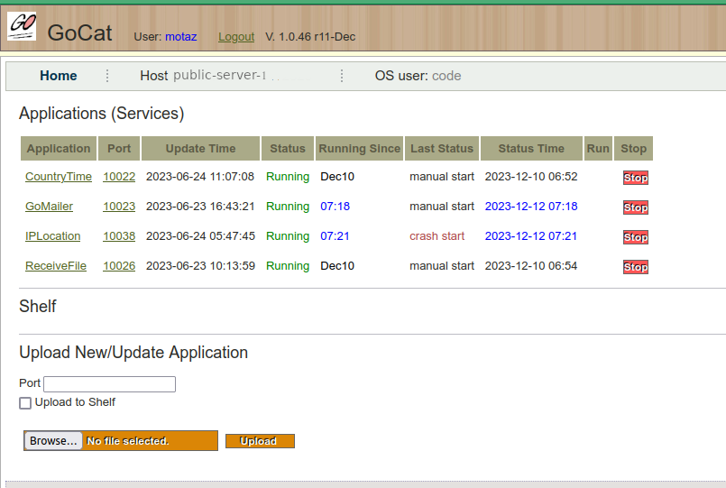

# GoCat Manager
<h3>Golang background services, web services and web apps uploader and manager for Linux</h3>
GoCat manages and host your Golang web services and web apps for Linux servers 
It is similar to Tomcat, but it is not a web container or web server for your applications, it only uploads, initializes start script, run, stop, and garud your web services/web applications, and it starts them if they have crashed. 

<h3>Download</h3>
Binary  download:  v 1.0.42
<a href="https://github.com/motaz/GoCat/releases/download/1.0.42/gocat.tar.xz">gocat.tar.xz For Linux 64</a>

<pre>tar -xf gocat.tar.xz
./GoCat &</pre>

It will listen to port 2009 (configurable) e.q. http://localhost:2009

<b>License</b>
LGPL

Developed and used by Code For Computer Software
<a href="http://code.sd">Code</a>
2018-2023
